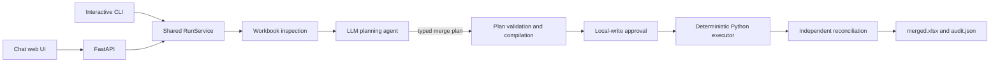

# Excel Merge Agent

A local, human-in-the-loop agent for merging `.xlsx` workbooks. An LLM interprets template instructions and proposes a typed merge plan; deterministic Python validates, executes, and independently verifies every workbook change.

The application supports two operations within the same workbook:

- **Add:** sum configured numeric cells or keyed rows across source workbooks.
- **Concatenate:** append qualifying source rows in upload order.

Different sheets and ranges can use different operations. Source columns may be inserted or reordered because the executor aligns fields through hierarchical workbook headers instead of relying only on fixed column positions.

## Key features

- One template and one or more `.xlsx` source workbooks
- LLM interpretation of template guidelines and workbook structures
- Typed `submit_merge_plan` tool calls through the Vercel AI SDK Python package
- Deterministic `openpyxl` execution—the model never writes cells directly
- Mixed add and concatenate operations in one workbook
- Semantic column mapping for shifted or inserted source columns
- Configurable source batches from 1 to 500 workbooks
- Preflight conflict detection and reusable human decisions
- One approval immediately before local output files are written
- Persistent, resumable task state in SQLite
- Independent cell, row, and untouched-template verification
- Chat-first web interface with visible tool calls and chronological progress
- Installable interactive CLI with persisted pause and resume
- Downloadable merged workbook and audit/lineage report
- Named OpenAI-compatible model connections with local API-key storage

## Architecture



The architectural boundary is intentional:

> The LLM proposes a declarative, reviewable configuration. Deterministic Python validates it, performs all workbook mutations, verifies the result, and controls recovery.

## Merge behavior

### Add

An add operation specifies its target sheet, source sheet, row alignment, key or positional range, numeric columns, placement, and column-alignment strategy. The executor converts expected numeric values safely and treats unexpected text as a blocking conflict rather than silently coercing it.

### Concatenate

A concatenate operation specifies source boundaries, output width, row filters, style source, stack placement, and note/end-marker behavior. Matching rows are streamed from every source in upload order. Formula cells use their cached displayed values.

### Column alignment

The default `auto` strategy maps source fields to template fields using normalized hierarchical header paths assembled from ordinary and merged header cells. Inserted or reordered source columns therefore do not shift values into unrelated template columns. Missing or ambiguous mappings become blocking schema conflicts.

## Human interaction

The agent first attempts safe, bounded recovery on its own. It asks the user only when information requires business knowledge that cannot be derived from the workbooks, configuration, prior answers, or runtime evidence.

The only routine approval is requested immediately before writing the local merged workbook and audit file. Inspection, planning, validation, and read-only diagnostics do not require approval.

## Batch processing

Large source collections are processed in configurable batches. The plan is created once, then:

- add operations accumulate batch-level partial totals;
- concatenate operations stream rows into the staged workbook in global upload order;
- progress is persisted by operation, batch, work unit, and source count;
- only the final verified workbook is published.

The default batch size is 50 and can be changed in the new-task composer.

## Model providers and API keys

The application supports named profiles for:

- OpenAI
- MiniMax
- DeepSeek
- Other OpenAI-compatible endpoints

Provider selection is explicit. The backend adapts provider-specific request behavior—for example, DeepSeek thinking is disabled during forced typed tool calls.

Model settings and secrets are stored separately:

- `models`: provider, endpoint, model, timeout, and credential reference
- `keys`: API keys only

Both files are local, permission-restricted, ignored by Git, and never returned through health, model, task, conversation, or audit APIs. A key is transmitted only to the provider endpoint explicitly configured by the user.

Create local copies from the safe examples before starting the backend:

```bash
cp models.example models
cp keys.example keys
export MERGE_AGENT_MODELS_PATH="$PWD/models"
export MERGE_AGENT_KEYS_PATH="$PWD/keys"
```

Replace the placeholder endpoint, model ID, and API key in those local copies. Never edit the tracked `.example` files with real credentials.

The current development checkout reads these files from the workspace directory above the project by default. The locations can be overridden:

```bash
export MERGE_AGENT_MODELS_PATH=/absolute/path/to/models
export MERGE_AGENT_KEYS_PATH=/absolute/path/to/keys
```

Example `models` file:

```json
{
  "version": 2,
  "default": "my-provider",
  "profiles": {
    "my-provider": {
      "provider": "custom",
      "base_url": "https://provider.example/v1",
      "model": "model-id",
      "credential": "my-provider-key",
      "api_mode": "chat_completions",
      "timeout": 60
    }
  }
}
```

Example `keys` file:

```json
{
  "version": 1,
  "credentials": {
    "my-provider-key": {
      "api_key": "replace-with-your-local-key"
    }
  }
}
```

After startup, connections can be created, updated, tested, and selected from **Model settings** in the web UI. The UI never retrieves stored key values.

## Requirements

- Python 3.12 or newer
- Node.js 22.13 or newer
- pnpm

## Run locally

Install and start the backend:

```bash
cd backend
python3.12 -m venv .venv
.venv/bin/pip install -e '.[test]'
.venv/bin/uvicorn app.main:app --host 127.0.0.1 --port 8000
```

In a second terminal, install and start the frontend:

```bash
cd frontend
pnpm install
pnpm dev --host 127.0.0.1 --port 3000
```

Open [http://localhost:3000](http://localhost:3000). The frontend expects the API at `http://localhost:8000`; override it with `NEXT_PUBLIC_API_URL` when necessary.

## Command-line interface

Installing the backend in editable mode registers the `excel-merge-agent` command. The CLI uses the same model profiles, SQLite run store, planning code, deterministic executor, approval binding, recovery logic, and verification code as the web interface. The API server does not need to be running.

Start a merge with explicit source files:

```bash
cd backend
.venv/bin/excel-merge-agent merge \
  --template /path/to/template.xlsx \
  --source /path/to/source-one.xlsx /path/to/source-two.xlsx \
  --batch-size 50 \
  --model-profile my-provider \
  --output /path/to/merged.xlsx
```

For large collections, load every `.xlsx` file from one or more directories:

```bash
.venv/bin/excel-merge-agent merge \
  --template /path/to/template.xlsx \
  --source-dir /path/to/sources \
  --recursive \
  --batch-size 100 \
  --output /path/to/merged.xlsx
```

The CLI prints model and tool progress chronologically, shows the reviewed plan, asks only unresolved business questions, and pauses for one explicit `approve` immediately before writing. If it is paused or interrupted, use the printed run ID:

```bash
.venv/bin/excel-merge-agent resume RUN_ID
.venv/bin/excel-merge-agent status RUN_ID
.venv/bin/excel-merge-agent runs
```

The audit destination defaults to `<output-stem>.audit.json` and can be changed with `--audit-output`. Approved output paths are persisted with the run; a resumed command cannot silently redirect an already approved write.

## Typical workflow

1. Configure and test a model connection.
2. Attach one template and one or more source workbooks.
3. Choose the source batch size.
4. Ask the agent to analyze and plan the merge.
5. Review the proposed operations, mappings, filters, and conflicts.
6. Resolve only questions that require user knowledge.
7. Ask the agent to execute and approve the single local-file write.
8. Download `merged.xlsx` and `audit.json` after verification succeeds.

## Tests

Run backend tests:

```bash
cd backend
.venv/bin/pytest -q
```

Run frontend checks:

```bash
cd frontend
pnpm lint
pnpm build
```

The current suite contains 36 backend tests covering representative and generic layouts, inserted source columns, invalid numeric values, duplicate content and keys, plan validation, web and CLI resumability, approved output publication, recovery, batch equivalence, reconciliation, provider configuration, secret separation, and sanitized provider errors.

### Synthetic test workbooks

The test suite and live agent check generate small fictional `.xlsx` workbooks in temporary directories. They require no external or private workbook files. The generated set covers numeric addition, row concatenation, nonnumeric conflicts, duplicate keys, aggregate rows, and an inserted source column.

## Security and correctness safeguards

- Only `.xlsx` uploads are accepted.
- Uploaded originals are never modified.
- Filenames are sanitized and input files are hashed.
- Workbook packages are checked for size, encryption, structure, and unsafe expansion.
- Duplicate source content and duplicate business keys are blocked.
- The reviewed plan, compiled mappings, input hashes, conflict decisions, excluded sources, output paths, and batch size are bound into the write grant.
- Execution starts from the untouched template on every retry.
- Output is staged and independently verified before atomic publication.
- Partial or failed results are never published as completed outputs.
- API keys are stored separately from model profiles and never exposed through application responses.

## Repository hygiene

Do not commit:

- `keys` or `models`
- virtual environments or `node_modules`
- frontend build output
- SQLite databases and per-run files
- uploaded source workbooks or generated outputs
- caches and operating-system metadata

The included `.gitignore` covers these paths. Before the first push, inspect the complete staged file list and run a secret scan.

## Documentation

See [`implementation_details.md`](implementation_details.md) for the backend state machine, merge configuration, approval binding, executor behavior, verification strategy, APIs, and current limitations.

## License

This project is available under the [MIT License](LICENSE).

## Current limitations

- Legacy `.xls` files are not supported.
- Formula handling depends on cached displayed values; the application does not run Excel's calculation engine.
- Add operations support one key column or positional alignment, not compound keys.
- Batching limits source-workbook memory, but the staged output still uses an in-memory `openpyxl` workbook.
- Distributed locking and multi-worker filesystem publication are outside the local prototype scope.
- Provider compatibility depends on streaming and valid nested tool-call support; the built-in capability test should be run whenever a model changes.
