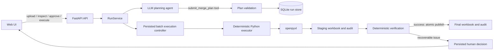

# Excel Merge Agent — Implementation Details

This document describes the current implementation of the Excel merge agent, with emphasis on the backend, execution guarantees, scalability, and human-in-the-loop behavior. It reflects the code as of 2026-08-31 rather than a future design.

## 0. Current implementation summary

- **Frontend:** chat-first React/Vinext workspace using the JavaScript Vercel AI SDK.
- **API:** local FastAPI service with run-oriented endpoints and AI SDK streaming chat.
- **Planning model:** selectable local OpenAI-compatible provider profiles; model settings and API keys are stored separately.
- **Planner:** the Python Vercel AI SDK (`ai==0.4.2`) with a forced, typed `submit_merge_plan` tool.
- **Executor:** deterministic `openpyxl` code; the model never writes or calculates workbook cells.
- **Persistence:** SQLite run records plus per-run input, staging, output, and audit files.
- **Operations:** sheet/range-specific `add` and `concatenate`, including mixed operations in one workbook.
- **Scalability:** configurable source batches from 1 to 500 workbooks, default 50.
- **Human control:** one approval immediately before local output writes; questions only for business meaning that cannot be derived from files.
- **Correctness:** compiled row/column mappings, input hashes, independent reconciliation, untouched-region checks, and atomic publication.

## 1. Purpose and current scope

The application merges several `.xlsx` source workbooks into an empty or partially populated template workbook. A language-model agent interprets the template and source structures, then proposes a typed merge configuration. Deterministic Python code validates and executes that configuration.

The system supports different operations on different sheets or ranges within one workbook:

- **Add**: add numeric values from corresponding source cells or keyed rows.
- **Concatenate**: append qualifying source rows in upload order.

The model never edits cells or calculates final workbook values itself. Its responsibility is limited to interpreting workbook evidence and selecting parameters accepted by the executor.

## 2. System architecture



There are four principal layers:

1. **React web UI** for uploads, plan review, conflict resolution, execution, and runtime decisions.
2. **FastAPI application** exposing run-oriented APIs and an AI SDK chat endpoint.
3. **Agent layer** using the Vercel AI SDK Python package for typed planning and the single write-approval tool.
4. **Deterministic workbook layer** using `openpyxl` for inspection, validation, merging, auditing, and verification.

## 3. Repository layout

Important backend files are:

| File | Responsibility |
| --- | --- |
| `backend/app/domain.py` | Pydantic domain models, operation schema, run state, conflicts, and human decisions |
| `backend/app/model_config.py` | Migrates, validates, redacts, and atomically persists local model profiles and credentials |
| `backend/app/model_runtime.py` | Creates per-task provider runtimes, applies provider adaptations, and probes capabilities |
| `backend/app/planner.py` | Runs typed model planning, validation feedback, and bounded planner retries |
| `backend/app/agent.py` | Defines the read-only run-summary tool and single approved-write tool |
| `backend/app/generic_workbook.py` | Generic workbook inspection, plan validation, preflight, execution, and verification |
| `backend/app/workbook.py` | Backward-compatible exports from the generic workbook module |
| `backend/app/service.py` | Run lifecycle, persistence coordination, approval, execution, pause, and resume |
| `backend/app/persistence.py` | SQLite-backed `RunRecord` persistence |
| `backend/app/main.py` | FastAPI routes and AI SDK-compatible chat handling |
| `backend/tests/fixture_specs.py` | Representative test-only merge configuration |
| `backend/tests/synthetic_workbooks.py` | Generates fictional temporary workbooks for tests and live checks |
| `backend/tests/test_merge_scenario.py` | End-to-end, validation, conflict, and resumability tests |
| `backend/tests/test_model_config.py` | Model configuration tests |

Test fixtures use only neutral English labels such as `Project 1` and `Project Type 1`; they contain no real locations, organizations, projects, or domain-specific source text.

## 4. Core domain model

### 4.1 Run state

A run is represented by `RunRecord` and can move through these states:

- `created`
- `files_uploaded`
- `inspecting`
- `plan_ready`
- `awaiting_write_approval`
- `awaiting_user_input`
- `recovering`
- `executing`
- `verifying`
- `completed`
- `failed`
- `cancelled`

The `verifying` value exists in the state model. In the current implementation, verification occurs inside an execution attempt and is not normally exposed as a separately persisted phase.

Legacy `awaiting_approval` and `awaiting_human` values remain readable for unfinished records created by older releases. New runs use the more precise states above.

On load, legacy states are migrated automatically: unresolved conflicts or questions become `awaiting_user_input`; otherwise the run becomes `awaiting_write_approval`. A legacy plan approval is never silently promoted into a write grant.

The record contains stable workbook IDs, uploaded files and hashes, workbook profiles, the proposed plan, an immutable compiled source-to-target mapping, batch configuration and progress, a write grant bound to the reviewed plan and execution configuration, planner provenance, conflicts and resolutions, recovery attempts, runtime questions, output paths, verification result, conversation snapshot, event history, a persistence revision, and any terminal error.

### 4.2 Merge configuration

The executor accepts `MergeSpec` schema version 2. Its main fields are:

- `template_family`: a model-assigned descriptive family name.
- `operations`: ordered `MergeOperation` objects.
- `stack_groups`: definitions for shared output body regions.
- `formula_policy`: currently `freeze_displayed_value`.
- `blank_numeric_policy`: currently `zero`.
- `retain_notes`: whether configured template notes or markers remain.
- `rationale`: explanation of the proposed plan.
- `guideline_citations`: exact nonblank template cells such as `Sheet1!A3` that support the interpretation.

Each operation specifies, as applicable:

- target `sheet` and optional `source_sheet`;
- `mode`: `add` or `concatenate`;
- row alignment: `row_key` or `position`;
- column alignment: `auto`, `header_path`, or explicit `position`;
- key and value columns;
- data start row and optional end marker;
- output width and style template row;
- row-filter rules;
- placement mode: `in_place` or `stack`;
- stack group and ordering.

The specification is serialized as canonical JSON and SHA-256 hashed. Approval is tied to this exact digest.

### 4.3 Row filters

Filtering is configuration-driven and language-neutral. `RowFilterRules` supports:

- prefix exclusions;
- exact-value exclusions;
- substring exclusions;
- regular-expression exclusions.

These rules can classify instruction rows, examples, notes, totals, or other non-data rows without embedding template-specific text in the executor.

### 4.4 Conflicts and decisions

There are two separate human-intervention concepts:

- **Preflight conflicts** are discovered before execution, such as unexpected text in a numeric aggregation cell. They are represented by `Conflict` and resolved using `ConflictResolution`.
- **Runtime decisions** pause an active execution or verification attempt. They are represented by persisted `HumanDecisionRequest` objects and resolved with a `HumanDecisionResponse`.

This distinction lets the system explain predictable data conflicts during review while still recovering safely from changes or problems encountered after approval.

## 5. End-to-end lifecycle

### 5.1 Create and upload

The UI creates a run, then uploads one template and one or more source `.xlsx` files. The backend:

1. sanitizes filenames;
2. streams copies under the run directory with a 50 MB per-workbook limit;
3. validates the OOXML ZIP package, entry count, encryption state, and expansion limits;
4. calculates SHA-256 hashes and assigns stable workbook IDs;
5. records roles and paths in the run;
6. never modifies the original uploaded files.

Only `.xlsx` is supported.

### 5.2 Inspect and plan

The workbook inspector builds bounded structural evidence for the model. Template evidence includes sheet dimensions, merged ranges, and up to 400 nonempty cells with coordinates, values, types, bold state, and fill information. Every source is inspected. Sources are grouped by structural fingerprint; the prompt includes up to two detailed representatives per group, a defensive global representative cap, total workbook and group counts, representative filenames, and sheet shapes. Detailed source evidence includes dimensions, labels, candidate labeled rows, numeric/nonempty column positions, and value-type counts.

Raw source numeric datasets are not sent wholesale to the model. The evidence is designed to be sufficient for structural planning while leaving actual calculations to Python.

The prompt also states the executor contract. The LLM must call:

```text
submit_merge_plan(configuration: MergeSpec)
```

The AI SDK generates the nested tool schema directly from the Pydantic model. The backend receives a validated `MergeSpec` and checks it against the actual workbooks. A malformed or schema-invalid model call triggers a fresh forced-tool planning attempt with the latest validation error as corrective feedback. Planning permits up to three attempts and records the successful attempt count in `PlannerProvenance`.

### 5.3 Plan validation

Before a plan is offered for approval, deterministic validation checks include:

- schema version and required operation fields;
- unique operation and stack-group IDs;
- existence of sheets, rows, and columns;
- valid regular expressions;
- complete add and concatenate parameters;
- compatible stack-group references and target sheets;
- no duplicate concatenate coverage;
- stacked add keys excluded from overlapping concatenate operations;
- classification of all nonblank template body rows;
- exact, nonblank template-cell guideline citations;
- adequate body boundaries and marker positions.

The template-body classification check is particularly important for generality. Every nonblank row in a configured body must be deliberately treated as data, a stacked-add key, or a filtered row. The engine does not guess based on hard-coded language.

### 5.4 Preflight analysis and user-owned meaning

The backend inspects the proposed plan and source workbooks before approval. Examples of blocking conflicts include:

- nonnumeric text in a cell the plan intends to add;
- missing source sheets;
- missing row keys;
- incompatible workbook structure;
- formula-error values;
- duplicate business keys;
- duplicate source workbook content that would otherwise be counted twice.

For unexpected nonnumeric values in numeric aggregation cells, allowed cell-level outcomes include:

- treat the value as zero;
- preserve a marker instead of producing a numeric result;
- skip that cell contribution;
- exclude the source workbook;
- abort.

The agent performs deterministic normalization and validation without approval. It asks only when workbook evidence cannot establish business meaning. Identical occurrences are grouped in the UI, and an `identical_in_run` answer is applied to every matching conflict. Execution remains blocked until every genuinely ambiguous blocking conflict is resolved.

### 5.5 Approval

The plan is displayed for review but has no separate approval gate. Before approval, Python compiles every operation into exact source rows, source columns, target rows, and target columns. Immediately before the write tool runs, the AI SDK presents one approval card showing the plan hash, inputs, and output files. After approval, the backend stores a `WriteApprovalGrant` bound to the exact plan hash, compiled-plan hash, template hash, source hashes keyed by stable source ID, conflict resolutions, excluded sources, and output paths.

The grant authorizes only deterministic staging, bounded recovery, verification, and publication for that configuration. It is bound to the plan and compiled-plan hashes, input hashes, conflict resolutions, excluded sources, output paths, and batch size. A relevant change invalidates the grant.

### 5.6 Agent tool dispatch

Execution is also exposed as a model tool:

```text
execute_approved_merge(
    run_id: str,
    spec_hash: str
)
```

The model never recopies the full configuration. Python loads the server-stored plan and compiled mapping, verifies both digests, persists the exact write grant, and invokes the deterministic executor. The former redundant execution-controller LLM turn has been removed.

### 5.7 Deterministic execution and verification

Each attempt:

1. revalidates input integrity and the approved plan hash;
2. opens an untouched copy of the template;
3. applies source data using only the reviewed compiled mappings, without rediscovering headers at runtime;
4. writes `merged.staging.xlsx` and `audit.staging.json`;
5. verifies the staged output;
6. atomically replaces the final output and audit files only after verification succeeds.

If the attempt pauses or fails, staging files are removed. A partial workbook is never published as the final result.

## 6. Merge operation semantics

### 6.1 Add

Addition is implemented locally in Python, not by the LLM and not through one model call per cell.

The executor loads workbook ranges with `openpyxl`, validates the configured numeric columns, and aggregates only the configured cells. Sources are opened in bounded batches; partial numeric totals and marker state are carried forward between batches. It touches only the columns explicitly listed in the operation.

Configured value columns identify template columns. With the default `auto` column alignment, each source column is located by a normalized hierarchical header path assembled from ordinary and merged header cells, for example `Plan Data → Field 12`. Source columns may therefore be inserted or reordered without shifting values into the wrong template field. A missing or ambiguous header path becomes a blocking schema conflict instead of falling back to a risky position.

Two alignment modes are supported:

- **`row_key`**: find a source row using the configured key column, then add its configured value columns to the corresponding output row.
- **`position`**: combine rows according to their relative position inside the configured range.

Two placements are supported:

- **`in_place`**: write results into fixed template rows.
- **`stack`**: generate aggregate rows inside a shared stack-group body, ordered by operation configuration.

Blank numeric cells follow the configured zero policy. Unexpected nonnumeric values are never silently coerced: they become preflight conflicts or, if newly encountered at runtime, a persisted human-decision request.

### 6.2 Concatenate

Concatenation is also a local bulk workbook operation. For each configured source, in upload order, the executor streams qualifying rows directly to the staged output rather than retaining the full concatenated body in memory. It:

1. identifies the configured source sheet and body boundary;
2. evaluates each candidate row against the configured filters;
3. maps source columns to template columns by hierarchical header path and copies the configured output width;
4. freezes displayed formula results according to the formula policy;
5. applies the configured template-row style;
6. appends rows into the target stack group.

Stack groups let add and concatenate operations share one target body while maintaining explicit ordering. The executor can retain the template's configured end marker or note after rebuilding the body.

### 6.3 Bounded batch execution

Each run has a configurable `batch_size` from 1 to 500, defaulting to 50. The setting is operational rather than part of the model-authored merge semantics, but it is copied into `WriteApprovalGrant`; changing it after approval invalidates that approval.

The model creates one global merge plan. Python then applies every operation over the active sources in stable upload order using bounded batches:

- **add:** initialize one accumulator per configured target cell, open at most one batch of source workbooks, update partial totals/markers, close the batch, and continue;
- **concatenate:** capture the target row style before clearing the template body, then yield rows from each batch directly into the staged workbook;
- **verification:** independently reconstruct expected values and lineage while opening source workbooks one at a time;
- **recovery:** discard staged artifacts and restart all batch counters from the untouched template.

`RunRecord.batch_progress` persists the current operation, batch number, work-unit counts, source counts, timestamps, and terminal status. The web UI polls active runs once per second and displays this state in Task details. It does not emit a conversation event for every batch, avoiding a noisy timeline; start and completion remain audited events.

Planning evidence is also bounded for large populations. Every source is inspected, but the LLM prompt includes at most two representatives per observed schema fingerprint (with a defensive global cap), plus aggregate schema-group counts and representative filenames. Exact conflict detection and compiled source mappings still cover every workbook.

Concatenation is therefore not a blind `pandas.concat`. It respects template boundaries, exclusions, styles, formulas, notes, and mixed-operation ordering.

## 7. Interactive and resumable execution

### 7.1 Recoverable runtime issues

Known runtime conditions are converted into `RecoverableExecutionIssue` instances and persisted as human decisions. Current cases include:

- the template changed after inspection;
- a source changed after inspection;
- a source cannot be read;
- a configured source sheet is missing;
- a configured source row or key is missing;
- a source body boundary or marker is missing;
- a newly encountered cell value cannot be aggregated;
- an ambiguous verification condition requires a user-owned decision.

An ordinary deterministic verification mismatch does not immediately ask the user. The service first performs its bounded automatic rebuild; if verification still fails, it leaves the run safely failed and publishes no output.

Unexpected programming defects are not mislabeled as user decisions; they put the run into `failed` with an error record.

### 7.2 Decision options

Python defines the allowed actions for each issue. Depending on context, these can include:

- `retry_execution`;
- `exclude_source_and_retry`;
- `return_to_planning`;
- `abort`.

The user can also enter a note, which is persisted with the selected action. The current implementation does not ask the LLM to invent action choices or paraphrase the question; the safety-critical options and messages are deterministic.

### 7.3 Resume behavior

When an issue occurs, Python classifies and handles it before asking the user. Deterministic verification failure triggers a bounded rebuild from the untouched template. Input drift triggers automatic re-inspection and plan revalidation; any prior write grant is invalidated. If the existing plan is still valid it returns directly to `awaiting_write_approval`, otherwise model replanning is required.

Only issues that require unavailable business knowledge create a question:

1. the run moves to `awaiting_user_input`;
2. the decision request and context are stored in SQLite;
3. staging artifacts are discarded;
4. the UI shows the question, phase, issue code, context, note field, and allowed actions.

The decision survives browser refreshes and backend restarts.

After a response:

- **Retry** starts a new attempt from the untouched template.
- **Exclude source and retry** records the source in `excluded_sources`; that source is omitted from all operations in subsequent attempts.
- **Return to planning** clears the approved-plan hash, refreshes inspection data and file hashes, and requires a newly generated plan and approval.
- **Abort** cancels the run.

Execution is resumable at the workflow level, not at an internal cell checkpoint. Every retry rebuilds the output from scratch, which prevents duplicate rows and partially applied additions.

## 8. Verification and audit

The staged workbook is verified before publication. Current checks include:

- all configured target sheets exist;
- no formula-error strings appear in the relevant output;
- excluded or instructional rows do not leak into configured stack bodies;
- legitimate stacked-add keys are not mistaken for filter leaks;
- configured retained markers still exist;
- every in-place written cell equals its independently recomputed expected value;
- every stacked output row matches its independently recomputed source-row fingerprint;
- untouched template values and number formats remain unchanged outside configured write regions.

The audit JSON records the plan identity, compiled mapping, source-to-target lineage, expected row fingerprints, source contributions, conflict handling, execution details, and verification result. The merged workbook and audit are downloadable only after successful completion.

## 9. Persistence and filesystem layout

Run metadata is stored in SQLite in a `runs` table with:

- run ID;
- current state;
- update timestamp;
- the complete serialized `RunRecord` JSON payload.
- an optimistic-concurrency revision.

An index supports state/update-time queries. Workbook files live under per-run directories resembling:

```text
backend/var/runs/<run-id>/
├── inputs/
│   ├── template/
│   ├── source-001/
│   ├── source-002/
│   └── ...
└── outputs/
    ├── merged.xlsx
    └── audit.json
```

Writes use compare-and-swap revision checks. A stale browser or overlapping request receives HTTP 409 instead of overwriting newer run state. Filesystem publication is still designed for a local single-service deployment rather than distributed multi-worker execution.

## 10. Model configuration and AI SDK integration

The backend uses `ai==0.4.2`, the Python implementation of the Vercel AI SDK. The UI uses the corresponding JavaScript AI SDK packages.

The backend model is selected from the workspace-level `models` JSON registry. `MERGE_AGENT_MODELS_PATH` can override that location. The registry contains named, nonsecret profiles with provider, endpoint, model, timeout, and a credential reference. API keys live in a separate workspace-level `keys` JSON file; `MERGE_AGENT_KEYS_PATH` can override its location. Both files are written atomically with mode `0600`, are ignored by the workspace and project ignore rules, are never served as files, and are never returned by API, health, run, audit, or conversation responses.

Legacy model files containing inline `api_key` values are migrated automatically to schema version 2. Migration removes inline keys from `models`, writes them into `keys`, preserves every named profile rather than silently ignoring nondefault entries, and retains the original default selection. A masked placeholder is explicitly rejected as a credential.

The supported provider presets are OpenAI, MiniMax, DeepSeek, and a custom OpenAI-compatible endpoint. The provider is selected explicitly rather than inferred from the key. DeepSeek tool turns add `thinking: disabled`, because forced typed tool calls are incompatible with its thinking mode. Other profiles use the standard OpenAI chat-completions protocol without provider-specific request mutation.

The runtime has independent capability probes for:

- streaming text;
- structured output;
- the exact forced nested tool call required by `submit_merge_plan`.

Structured-output probe failure does not necessarily prevent this application from working because planning uses typed tool calling. The configured provider must still support the streaming and nested tool-call behavior used by the application.

Each run records its selected `model_profile_id` at creation. Planning, explanations, and subsequent agent chat use that stable profile even if the user changes the default for new tasks. Planner provenance stores the profile, provider, model identifier, evidence digest, tool name, and number of attempts.

Malformed planner tool calls are treated as recoverable model-output errors. If the model omits the required `configuration` object or submits a schema-invalid plan, the planner makes up to three fresh forced-tool attempts and includes the latest validation error as corrective feedback. The successful attempt count is stored in planner provenance. If all attempts fail, the run remains failed without writing any workbook data, and the chat UI offers an explicit **Retry model planning** action for the same uploaded files.

## 11. Backend API

| Method | Endpoint | Purpose |
| --- | --- | --- |
| `GET` | `/api/health` | Service and safe model-runtime status |
| `POST` | `/api/model/probe` | Probe configured model capabilities |
| `GET` | `/api/model-connections` | List redacted local model profiles |
| `PUT` | `/api/model-connections/{profile_id}` | Create or update a profile and optionally replace its local key |
| `POST` | `/api/model-connections/{profile_id}/activate` | Select the default profile for new tasks |
| `POST` | `/api/model-connections/{profile_id}/probe` | Test streaming, structured output, and planning tool compatibility |
| `GET` | `/api/runs` | List runs |
| `POST` | `/api/runs` | Create a run |
| `GET` | `/api/runs/{run_id}` | Get the complete run status |
| `PUT` | `/api/runs/{run_id}/batch-settings` | Set the bounded source batch size (1–500) |
| `POST` | `/api/runs/{run_id}/files` | Upload template and sources |
| `POST` | `/api/runs/{run_id}/inspect` | Inspect workbooks and generate a plan |
| `POST` | `/api/runs/{run_id}/approve` | Approve the exact current plan |
| `POST` | `/api/runs/{run_id}/conflicts/{conflict_id}/resolve` | Resolve a preflight conflict |
| `POST` | `/api/runs/{run_id}/execute` | Execute the approved plan |
| `POST` | `/api/runs/{run_id}/decisions/{decision_id}/resolve` | Resolve and resume a paused runtime issue |
| `GET` | `/api/runs/{run_id}/output` | Download the completed workbook |
| `GET` | `/api/runs/{run_id}/audit` | Download the execution audit |
| `POST` | `/api/runs/{run_id}/explain` | Get a run/plan explanation |
| `PUT` | `/api/runs/{run_id}/conversation` | Persist the current validated AI SDK UI-message snapshot |
| `POST` | `/api/runs/{run_id}/chat` | AI SDK-compatible run chat |

## 12. Web UI

The frontend is a Next/Vinext React application using `useChat` from the AI SDK. It now uses a chat-first task workspace with a recent-task rail, central conversation, persistent composer, and contextual task-details panel. The conversation renders both model messages and deterministic run events in chronological order. The main workspace supports:

- template and source attachments inside the new-task composer;
- configurable source batch size before task creation, defaulting to 50;
- a local model-connections dialog for provider, endpoint, model, timeout, masked key replacement, capability testing, and default selection;
- model-driven inspection and planning;
- inline operation, filter, citation, rationale, and exact-hash review;
- expandable compiled mapping details, including shifted source columns;
- inline preflight conflict resolution;
- one inline local-file-write approval bound to the exact reviewed plan;
- rendered AI SDK tool states, parameters, results, errors, and execution approvals, with explicit tool icons and function names;
- execution through the agent/backend boundary from the conversation;
- persisted runtime-decision cards and resume actions;
- live persisted batch progress with operation, batch, work-unit, and source counts;
- a retry action for failed model planning without re-uploading files;
- automatic re-execution or replanning after the selected decision;
- restored conversation snapshots and run events after refresh, ordered by conversation turn and AI SDK message-part sequence rather than assistant completion time;
- inline verified-output and audit downloads;
- distinct backend-connectivity and model-probe states, with retry rather than a false empty-task state;
- sanitized, actionable connection failures for balance/quota, authentication, permissions, model/endpoint lookup, rate limits, timeouts, and network errors;
- reconciliation counts for written cells and rows;
- conditional autoscroll that does not pull users away from history they are reading.

The execution experience has one explicit gate: the AI SDK write-tool approval immediately before local workbook and audit writes. Read-only inspection, planning, validation, and recovery diagnostics do not request approval. Business questions remain domain-level cards and are grouped where the same answer can be reused.

## 13. Safety properties

The current design enforces the following properties:

- Only `.xlsx` files are accepted.
- Uploaded originals are never edited.
- Filenames are sanitized and inputs are hashed.
- Input hashes are checked again before execution.
- The approved configuration and compiled mapping must match their stored digests exactly.
- Duplicate source content and duplicate business keys are blocked before writing.
- Blocking conflicts prevent execution until resolved.
- The LLM cannot directly manipulate workbook cells.
- Output is staged and verified before atomic publication.
- Pauses and failures do not publish partial results.
- Retries begin from the untouched template.
- Secrets are not returned in model/health summaries.
- Model profiles and secret keys are separate, private local files; keys are sent only to the explicitly configured provider endpoint as authentication.

## 14. Tests and verification status

The backend test suite currently covers:

- a generated representative template/source scenario with fictional values;
- a generated source with an inserted column after K;
- unexpected nonnumeric aggregate cells;
- a separate generic layout using unrelated sheet names and data;
- invalid column configuration;
- duplicate concatenate coverage;
- unclassified template body rows;
- invalid filters and missing boundaries;
- persisted pauses across a newly constructed service instance, simulating backend restart;
- source exclusion followed by successful retry;
- duplicate source-content detection and duplicate business-key detection;
- persisted compiled mappings for shifted columns;
- independent reconciliation detecting a deliberately tampered output;
- verification pause followed by return to planning;
- model configuration loading and validation.

At the time of this document, the latest verification completed with 33 backend tests passing, together with successful frontend lint and production build checks. The additional tests verify optimistic concurrency, conversation recovery, legacy approval-state migration, safe plan-hash upgrades, malformed planner-call retry, batch result equivalence/progress, batch approval invalidation, resilience to incompatible historical records, legacy model-registry migration, key separation and permissions, key-preserving profile edits, rejection of masked credential placeholders, and sanitized provider-error classification.

Useful local commands are:

```bash
cd backend
.venv/bin/python -m pytest -q
.venv/bin/uvicorn app.main:app --reload --port 8000
```

```bash
cd frontend
pnpm lint
pnpm build
pnpm dev
```

The frontend expects the API on port 8000 and normally serves locally on port 3000.

## 15. Current limitations

- Legacy `.xls` files are not supported.
- Formula handling uses cached displayed values; the service does not run Excel's calculation engine.
- Batching bounds source-workbook memory, but the staged output workbook is still held by `openpyxl`; exceptionally large outputs may require a write-only or XML-streaming writer.
- Styling is copied according to configured template rows, but macros, external connections, and every advanced Excel feature are outside the current scope.
- Add operations support one key column or positional alignment, not compound keys.
- Column mappings are derived from hierarchical headers and persisted in the compiled plan; explicitly authored arbitrary mapping rules are not yet part of the LLM-facing schema.
- Excluding a source excludes it from every operation in that execution run.
- Retries restart the merge rather than resuming at a cell-level checkpoint.
- Persistence rejects stale run updates, but distributed locking and multi-worker filesystem publication remain outside the local MVP.
- Existing unfinished schema-version-1 plans must be replanned as schema version 2.
- The agent relies on provider-compatible streaming and tool calls; provider behavior should be re-probed when the configured model changes.
- Planner retries reduce transient malformed tool calls, but a provider that repeatedly emits invalid arguments can still exhaust all three attempts and leave the run safely failed.

## 16. Architectural boundary

The most important implementation boundary is:

> The LLM proposes a declarative, reviewable merge configuration; deterministic Python validates it, executes all workbook mutations, verifies the result, and controls every permitted recovery action.

This boundary makes the agent flexible across workbook layouts without handing arithmetic, cell mutation, or recovery policy to probabilistic model output.
